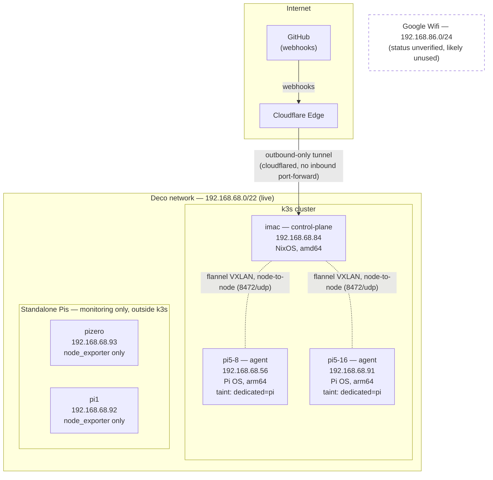
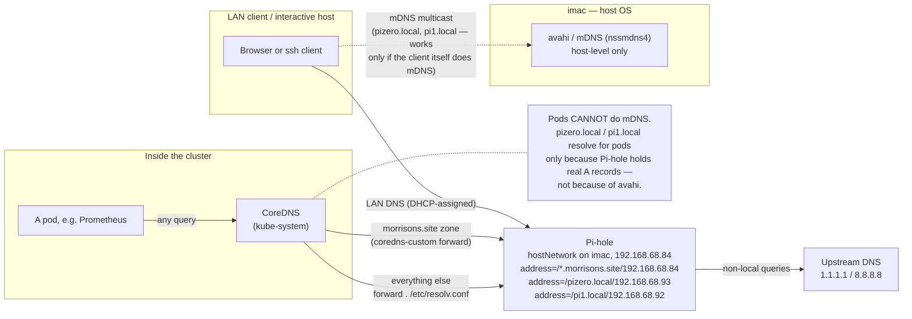
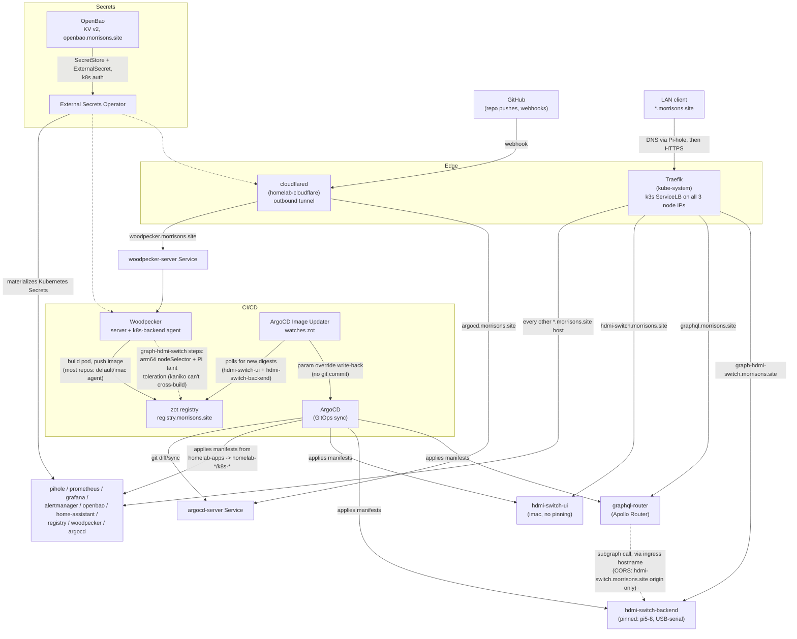

# Network Topology

This is a reference doc for how this homelab's machines, network segments, and
software actually talk to each other — nodes, subnets, and the pieces that
affect data flow (DNS, ingress, CI/CD, secrets). It was built by cross-checking
[`networking.md`](networking.md), [`cluster.md`](cluster.md), and
[`naming.md`](naming.md) against the actual manifests/configs in every
`homelab-*`/`k8s-*`/`pi-*` repo and against a read-only `kubectl get nodes -o
wide`, not by trusting any single doc.

## Where this doc disagrees with existing docs

Several existing docs describe an earlier or planned state that isn't what's
actually running. Trust this doc's version of the following:

- **`cluster.md` describes a single-node cluster (`matt-nix`, planning to add
  one Pi 5).** The real cluster today is **three nodes**: `imac`
  (control-plane), `pi5-8`, and `pi5-16` (both agents), confirmed via
  `kubectl get nodes -o wide`. Both Pi 5s are already joined and running Pi OS
  (Debian trixie), not NixOS — the "OS Decision" TODO in `cluster.md` was
  resolved in favor of Pi OS, and the join happened via
  `pi-provision/join-node.sh`, not the NixOS module path `cluster.md`
  describes.
- **`networking.md` frames the Deco network (`192.168.68.0/22`) as "not yet
  carrying homelab traffic" and Google Wifi (`192.168.86.0/24`) as the
  current network.** That's backwards from reality: every cluster node, every
  standalone Pi, and every Pi-hole DNS entry in this homelab is on
  `192.168.68.x` today. Google Wifi's actual current status is unknown from
  the repos surveyed here — it may already be retired. Treat the Deco network
  as the live network, not a future migration target.
- **`networking.md` lists a "MetalLB IP pool: 192.168.86.2 – 192.168.86.19"
  under "Current State."** No MetalLB Application exists in `homelab-apps`,
  and no `homelab-metallb` repo exists. Traefik's `LoadBalancer` Service gets
  its external IPs from **k3s's built-in ServiceLB** (Klipper), which simply
  hands it every node's IP (`192.168.68.56`, `.84`, `.91` today) — confirmed
  via `kubectl get svc -n kube-system traefik -o wide`. MetalLB is referenced
  in `naming.md`'s rename table but doesn't appear to be deployed.
- **`networking.md`'s Pi-hole TODO says "deploy after Protectli/OPNsense
  migration is complete."** Pi-hole is already deployed and is the live LAN
  DNS server today (`homelab-pihole`), well ahead of any OPNsense migration.
- A comment in `dotfiles/hosts/imac/default.nix` justifies enabling
  `services.avahi.nssmdns4` with *"required by Prometheus and other apps to
  reach pi5-\*.local."* This is misleading on two counts: Prometheus runs as a
  pod and pods cannot use host-level mDNS/avahi at all (see the DNS section
  below), and `pi5-8`/`pi5-16` aren't resolved via `.local`/mDNS anyway —
  they're k3s cluster nodes with static entries in CoreDNS's `NodeHosts`. The
  avahi setting's actual practical value is host-level interactive access
  (e.g. `ssh pizero.local` run directly from `imac`'s shell), not anything
  Prometheus depends on.

## Nodes

| Node | Role | IP | OS | Arch | Notes |
|---|---|---|---|---|---|
| `imac` | k3s control-plane | `192.168.68.84` | NixOS 26.11 (`dotfiles/hosts/imac`) | amd64 | Also runs `avahi`/mDNS at the host level. Currently where Home Assistant and Pi-hole happen to land (see hostNetwork section) despite no `nodeSelector` pinning them there — a latent risk flagged in `k8s-matter-server/PROPOSAL.md`. |
| `pi5-8` | k3s agent | `192.168.68.56` | Raspberry Pi OS (Debian trixie) | arm64 | Joined via `pi-provision/join-node.sh`; tainted `dedicated=pi:NoSchedule` by default so nothing schedules there unless it tolerates the taint. Traefik explicitly tolerates it. |
| `pi5-16` | k3s agent | `192.168.68.91` | Raspberry Pi OS (Debian trixie) | arm64 | Same as `pi5-8`. |
| `pizero` | standalone, outside k3s and outside Nix | `192.168.68.93` | Raspberry Pi OS | arm | Runs only `node_exporter` (`pi-provision/install-node-exporter.sh`); scraped by Prometheus as a plain HTTP target, not a cluster member. |
| `pi1` | standalone, outside k3s and outside Nix | `192.168.68.92` | Raspberry Pi OS (32-bit, ARMv6) | arm | Same as `pizero` — monitoring-only, not a workload node. |

`pizero` and `pi1` are provisioning/monitoring footnotes, not cluster
capacity: they exist so Prometheus has host-level metrics for every physical
machine on the LAN, including the two too old/small to run k3s.

## Network segments

- **Deco (TP-Link Deco, `192.168.68.0/22`, covers `192.168.68.0`–`192.168.71.255`)**
  — the live network. Every node above is on it. Backbone is Ethernet-over-Coax
  between access points.
- **Google Wifi (`192.168.86.0/24`)** — described as the current network in
  `networking.md`; no evidence in any repo surveyed here shows it's still
  carrying homelab traffic. Status not verified further in this doc.
- No OPNsense/Protectli firewall is in place yet (per `networking.md`'s own
  "Planned Architecture" section, and nothing in any repo contradicts that) —
  the Deco router is doing routing/DHCP/DNS-handoff duty with no VLAN or
  firewall segmentation.

## Diagram: physical and network topology



## Standalone Pis and why they're monitoring-only

`pizero` and `pi1` never join k3s — they're old/low-power hardware
(`pi-provision/README.md` lists a Pi Zero 2 W and an original Pi 1 Model B,
512MB). `pi-provision/install-node-exporter.sh` puts `node_exporter` on them
directly, and `homelab-prometheus`'s `prometheus-config` ConfigMap scrapes
them as static hostname targets:

```yaml
- job_name: 'pi-node-exporter'
  static_configs:
    - targets:
        - 'pizero.local:9100'
        - 'pi1.local:9100'
```

That single scrape config is what makes the DNS three-tier setup below matter
in practice — see the next section.

## DNS resolution: three mechanisms, three different reach

This homelab has three separate DNS/name-resolution mechanisms, each with a
different scope. Confusing them is the most likely way to break something
here, so this is worth reading carefully.

1. **Pi-hole** (`homelab-pihole`) is the LAN's real DNS server. It runs with
   `hostNetwork: true` (binds directly to a node's real network interface,
   port 53) and currently lands on `imac` (`192.168.68.84`) — incidentally,
   not via a `nodeSelector`. Its `05-local-dns.conf` (mounted from the
   `pihole-local-dns` ConfigMap) has explicit `address=/host/ip` entries:
   - Every `*.morrisons.site` ingress hostname → `192.168.68.84`
     (`argocd`, `prometheus`, `grafana`, `alertmanager`, `openbao`,
     `home-assistant`, `pihole`, `homelab`/`control`, `registry`,
     `woodpecker`, `hdmi-switch`, `graph-hdmi-switch`, `graphql`).
   - Two bare `.local` hostnames for the standalone Pis:
     `pizero.local` → `192.168.68.92`... wait, `192.168.68.93`, and
     `pi1.local` → `192.168.68.92`.
   - Upstream (non-local) queries forward to `1.1.1.1` / `8.8.8.8`
     (`PIHOLE_DNS_1`/`PIHOLE_DNS_2` in the Deployment).
   - How LAN clients and cluster nodes are told to *use* Pi-hole as their
     resolver (DHCP option on the Deco router, presumably) isn't captured in
     any repo surveyed here — it's out-of-band router configuration.

2. **CoreDNS**, inside the k3s cluster, is what every pod actually queries.
   It has three layers of its own:
   - The `cluster.local` zone (pod/Service DNS) is handled internally, as
     normal for any k3s cluster.
   - A `coredns-custom` ConfigMap (`homelab-coredns`) adds an explicit zone
     forward: `morrisons.site:53 { forward . 192.168.68.84 }` — so pods
     resolve `*.morrisons.site` by going straight to Pi-hole, the same
     answer a LAN client would get.
   - Everything else (including `pizero.local`/`pi1.local`, and the public
     internet) falls through to `forward . /etc/resolv.conf` — i.e.
     whatever DNS resolver the CoreDNS *pod's* node has configured for
     itself. In practice that's Pi-hole too (per point 1), so
     `pizero.local`/`pi1.local` resolve for pods only because Pi-hole has
     real `address=` entries for them — **not** because of mDNS.
   - This is exactly why Prometheus (a pod) can reach `pizero.local:9100`
     and `pi1.local:9100`: it's going pod → CoreDNS → node resolver →
     Pi-hole → static A record. No multicast involved anywhere in that
     path.

3. **avahi/mDNS** (`services.avahi.nssmdns4 = true` in
   `dotfiles/hosts/imac/default.nix`) is enabled on the `imac` NixOS host
   itself, for host-level `.local` resolution — e.g. running `ssh
   pizero.local` interactively from a shell on `imac`. This only helps
   processes running directly on that host's OS. It does **not** help
   anything running as a pod (pods don't get real multicast reachability
   through flannel), which is precisely why Prometheus can't rely on it and
   needs the real Pi-hole DNS entries from point 1 instead.

## Diagram: DNS resolution paths



## Ingress and edge

Two separate paths bring traffic into the cluster, for two different
purposes:

- **Traefik** (`homelab-traefik`, k3s's bundled ingress controller — this
  repo only ships a `HelmChartConfig` customization, no Deployment of its
  own) handles essentially all LAN-facing `*.morrisons.site` hostnames:
  Pi-hole, ArgoCD, Prometheus, Grafana, Alertmanager, OpenBao, Home
  Assistant, the zot registry (`registry.morrisons.site`), Woodpecker,
  both hdmi-switch hostnames (`hdmi-switch.morrisons.site` and
  `graph-hdmi-switch.morrisons.site` — see below), and the GraphQL router
  (`graphql.morrisons.site`). It redirects plain HTTP to HTTPS and
  is reachable at all three node IPs via k3s's ServiceLB (see "MetalLB"
  discrepancy above). Its Service explicitly tolerates the
  `dedicated=pi:NoSchedule` taint so it can also be scheduled/exposed via
  the Pi agent nodes.
- **Cloudflare Tunnel** (`homelab-cloudflare`, a `cloudflared` Deployment)
  is a fully separate, outbound-only path used for exactly two hostnames
  that need to be reachable from the public internet — specifically so
  **GitHub can deliver webhooks** without opening any inbound port on the
  router: `woodpecker.morrisons.site` and `argocd.morrisons.site`. Its
  `config.yml` routes both **directly to the in-cluster Service DNS name**
  (`woodpecker-server.woodpecker.svc.cluster.local`,
  `argocd-server.argocd.svc.cluster.local`) — it bypasses Traefik entirely
  for these two. Everything else hitting the tunnel gets `http_status:404`.
- **GraphQL router** (`homelab-graphql-router`, namespace `graphql-router`,
  Apollo Router) is the federated GraphQL gateway at
  `graphql.morrisons.site`. Its `router.yaml` (`graphql-router-config`
  ConfigMap) sets `include_subgraph_errors: {all: true}` and an explicit
  `cors.policies` entry allowing only `https://hdmi-switch.morrisons.site`
  as an origin (methods `GET`/`POST`/`OPTIONS`). Its supergraph composition
  (`supergraph.graphql`, embedded in the same ConfigMap) currently defines a
  single subgraph, `hdmi-switch`, resolved at
  `https://graph-hdmi-switch.morrisons.site/graphql` — i.e. it calls the
  pinned backend over the same public ingress hostname a browser would use,
  not an in-cluster Service DNS name.
- **cert-manager** (`homelab-cert-manager` + `-crds` + `-config`) issues a
  single wildcard `*.morrisons.site` certificate via Let's Encrypt DNS-01,
  authenticating to Cloudflare's API (token pulled from OpenBao) to place
  the DNS-01 challenge record. That cert is installed cluster-wide as
  Traefik's default `TLSStore`. Note: `homelab-cert-manager-config` says
  it's currently issued via the **staging** Let's Encrypt issuer, not
  production — so the cert itself won't be trusted by browsers as-is.

### hdmi-switch: one namespace, two hostnames, split node placement

`k8s-hdmi-switch` is a manifests-only repo (Helm chart, no application
source) that deploys both halves of the hdmi-switch app into a single
`hdmi-switch` namespace, fronted by one `Ingress` with two host rules:

| Hostname | Backend Service | Deployment | Source repo | Node placement |
|---|---|---|---|---|
| `hdmi-switch.morrisons.site` | `hdmi-switch-ui` (:80) | `hdmi-switch-ui` | `ui-hdmi-switch` (React PWA) | No `nodeSelector`/toleration — schedules on `imac`, the only untainted node. |
| `graph-hdmi-switch.morrisons.site` | `hdmi-switch-backend` (:8000) | `hdmi-switch-backend` | `graph-hdmi-switch` (Python GraphQL) | Pinned via `nodeSelector: kubernetes.io/hostname: pi5-8` + a toleration for `dedicated=pi:NoSchedule`. Runs `privileged: true` with a `hostPath` mount of `/dev/ttyUSB0` — it needs the physical USB-serial connection to a real TESmart HDMI switch wired into that specific Pi, so it can only ever run there. Its image is built arm64-only for the same reason. |

The GraphQL router (above) treats `graph-hdmi-switch.morrisons.site` as its
only subgraph and restricts its CORS policy to accept browser calls solely
from `hdmi-switch.morrisons.site` — so the UI is the only origin allowed to
call through the router to the pinned backend.

## Diagram: ingress and CI/CD data flow



## GitOps and secrets flow

- **ArgoCD** (`homelab-argocd`) is the single sync point: `homelab-apps` is
  an App-of-apps whose `Application` objects each point at one
  `homelab-<service>`/`k8s-<service>` repo's `manifests/` path. ArgoCD keeps
  the cluster's live state matched to what's committed in each repo.
- **Woodpecker** (`homelab-woodpecker`) is CI, triggered by GitHub webhooks
  delivered through the Cloudflare Tunnel above. Its agent runs with a
  Kubernetes backend (`WOODPECKER_BACKEND=kubernetes`), meaning build jobs
  run as pods inside the cluster itself, not on a separate build box. It now
  builds and pushes images for both hdmi-switch repos: `ui-hdmi-switch`
  builds on whatever node the scheduler picks by default (effectively
  `imac`, the only untainted node), while every step in
  `graph-hdmi-switch`'s pipeline (`clone`, `build-test`, `test`,
  `build-release`, `verify-deploy`) sets `backend_options.kubernetes` to a
  `kubernetes.io/arch: arm64` `nodeSelector` plus a toleration for
  `dedicated=pi:NoSchedule` — its Dockerfile's base images are arm64-only,
  and kaniko can't cross-build/emulate, so the build itself has to run
  natively on a Pi. Per-step `nodeSelector` overrides like this only take
  effect because `homelab-woodpecker`'s agent Deployment now sets
  `WOODPECKER_BACKEND_K8S_POD_NODE_SELECTOR_ALLOW_FROM_STEP=true`
  (`agent-deployment.yaml`) — it's disabled by default in Woodpecker for
  security (otherwise any push-access user could pin pipeline pods onto
  arbitrary nodes), so this was a global CI change, not something scoped to
  one repo's pipeline file alone.
- **zot** (`homelab-zot`) is the in-cluster OCI registry
  (`registry.morrisons.site`) Woodpecker pushes to and other components
  (ArgoCD Image Updater, and pods pulling images) read from.
- **ArgoCD Image Updater** (`homelab-argocd-image-updater`) watches zot for
  new image digests and updates the single `k8s-hdmi-switch` Application via
  the `argocd` write-back method — a **parameter override**, not a git
  commit. It now tracks two separate image aliases on that one Application:
  `hdmi-switch-ui` (from `ui-hdmi-switch`) and `hdmi-switch-backend` (from
  `graph-hdmi-switch`), each updated independently as new digests land. This
  is the one path in the whole GitOps flow that doesn't go
  human-commits-then-ArgoCD-diffs, which is why `TODO.md` flags a follow-up
  idea (a `/version` endpoint + `verify.sh` check) to give it the same
  deployed-commit guarantee every other service gets for free from ArgoCD's
  own Synced/Healthy status.
- **OpenBao + External Secrets Operator** are the secrets backbone:
  OpenBao (`homelab-openbao`) holds the actual secret values in a KV v2
  engine; every consuming app's own repo carries a `SecretStore` +
  `ExternalSecret` pair; ESO (`homelab-external-secrets` +
  `-external-secrets-crds`) authenticates to OpenBao via Kubernetes auth and
  materializes a real Kubernetes `Secret` the pod consumes. Nothing
  sensitive is ever committed to any `homelab-*` repo — all of them are
  public on GitHub. OpenBao's Helm `values.yaml` now also sets a
  `telemetry` stanza (`unauthenticated_metrics_access = true`,
  `prometheus_retention_time = "24h"`) exposing Prometheus-formatted metrics
  at `/v1/sys/metrics`; `homelab-prometheus`'s `openbao` scrape job
  (`configmap.yaml`) polls `homelab-openbao.openbao.svc:8200` for it, and an
  `OpenBaoSealed` alert rule (`vault_core_unsealed == 0`, severity
  `critical`) rides the existing Alertmanager → Discord pipeline. Separately,
  `injector.tolerations` in the same `values.yaml` now tolerates
  `dedicated=pi:NoSchedule` — needed because the agent-injector's built-in
  pod anti-affinity otherwise leaves a `RollingUpdate` surge pod stuck
  `Pending` with only `imac` untainted to land on. This is confirmed live,
  not just committed: `kubectl get application -n argocd homelab-openbao`
  shows `Synced`/`Healthy`, and the injector pod is currently running on
  `pi5-16`.

## `hostNetwork: true` services — bypassing cluster networking

Three services either use or are proposed to use `hostNetwork: true`, which
makes them bind directly to a node's real network interface instead of
flannel's pod network. All three share the same underlying reason: LAN-local
multicast (mDNS/Zeroconf, and for Matter, IPv6 link-local multicast) doesn't
cross the flannel bridge, so anything that needs real multicast reachability
has to opt out of normal pod networking entirely.

| Service | Status | Why `hostNetwork` | Node placement |
|---|---|---|---|
| Home Assistant (`homelab-home-assistant`) | **Deployed** | LAN device discovery (mDNS/Zeroconf — Hue, Chromecast, etc.) | No `nodeSelector`; currently lands on `imac` incidentally. Flagged as a latent risk in `k8s-matter-server/PROPOSAL.md` — if rescheduled, its hardcoded Pi-hole DNS entry (`192.168.68.84`) would silently go stale. |
| Pi-hole (`homelab-pihole`) | **Deployed** | Must bind real port 53 on a LAN-reachable interface so LAN clients and node resolvers can query it directly | No `nodeSelector` either; currently also lands on `imac` incidentally — same latent-risk shape as Home Assistant. |
| Matter server (`k8s-matter-server`) | **Proposed only** — `PROPOSAL.md`, no manifests, no ArgoCD Application, nothing deployed | Matter commissioning needs mDNS + IPv6 link-local multicast, same hard requirement as Home Assistant | Proposal recommends an explicit `nodeSelector: kubernetes.io/hostname: imac` to co-locate with Home Assistant (their WebSocket link would otherwise depend on cluster DNS, which a `hostNetwork` pod doesn't get) — a stricter approach than the two services above, which have no such pinning today. |

Only Home Assistant was called out for this in the original task brief, but
the same constraint now applies to two more services (Pi-hole, and the
proposed Matter server) — worth treating as a general homelab pattern rather
than a one-off.
